# **Installation**
<br>

## **Docker Installation**

<br>
Jenkins pipelines work really well with Docker. Without Docker you need to install additional tools and add different agents to Jenkins. With Docker,

- there is no need to install additional tools, you just use images of these tools. Jenkins will download them from internet for you (Docker Hub).

- For each stage in the pipeline you can use a different image (i.e. tool). Essentially you get "micro Jenkins agents" which only exists temporary. Hence you do not need fixed agents anymore. This makes your Jenkins setup much more clean.

- Also, we can utilize all the advantages of Docker Containers

Still there are few disadvantages - priviledges.

<br>

## **Docker - Install using the repository**
<br>
Before you install Docker Engine for the first time on a new host machine, you need to set up the Docker repository. Afterward, you can install and update Docker from the repository.

<br>


### **Set up the repository**

<br>

1. Update the apt package index and install packages to allow apt to use a repository over HTTPS:

    ```
    sudo apt-get update

    sudo apt-get install \
        ca-certificates \
        curl \
        gnupg \
        lsb-release
    ```
    <br>

2. Add Docker’s official GPG key:
    ```
    sudo mkdir -p /etc/apt/keyrings

    curl -fsSL https://download.docker.com/linux/ubuntu/gpg | sudo gpg --dearmor -o /etc/apt/keyrings/docker.gpg
    ```

    <br>

3. Use the following command to set up the repository:

    ``` 
    echo \ 
    "deb [arch=$(dpkg --print-architecture) signed-by=/etc/apt/keyrings/docker.gpg] https://download.docker.com/linux/ubuntu \
    (lsb_release -cs) stable" | sudo tee /etc/apt/sources.list.d/docker.list > /dev/null
    ```
<br>

### **Install Docker Engine**

<br>

1. Update the apt package index, and install the latest version of Docker Engine, containerd, and Docker Compose:

    ```
    sudo apt-get update
    
    sudo apt-get install docker-ce docker-ce-cli containerd.io docker-compose-plugin
    ```
2. To install a specific version of Docker Engine, list the available versions in the repo, then select and install:

    a. List the versions available in your repo:

    ```
    apt-cache madison docker-ce
    ```

    b. Install a specific version using the version string from the second column, for example, ```5:20.10.16~3-0~ubuntu-jammy```.

    ```
    sudo apt-get install docker-ce=<VERSION_STRING> docker-ce-cli=<VERSION_STRING> containerd.io docker-compose-plugin
    ```

3. Verify that Docker Engine is installed correctly by running the ```hello-world``` image.
    ```
    sudo docker run hello-world
    ```

    This command downloads a test image and runs it in a container. When the container runs, it prints a message and exits.

Docker Engine is installed and running. The ```docker``` group is created but no users are added to it. You need to use ```sudo``` to run Docker commands. Continue to Linux postinstall to allow non-privileged users to run Docker commands and for other optional configuration steps.

<br>

## **Jenkins Setup**

<br>

On Linux and MacOS:

1. Open up a terminal window.

2. Create a ```bridge network``` in Docker using the following ```docker network create``` command:

    ```
    docker network create jenkins
    ```

3. In order to execute Docker commands inside Jenkins nodes, download and run the ```docker:dind``` Docker image using the following ```docker run``` command:

    ```
    docker run \
        --name jenkins-docker \
        --rm \
        --detach \
        --privileged \
        --network jenkins \
        --network-alias docker \
        --env DOCKER_TLS_CERTDIR=/certs \
        --volume jenkins-docker-certs:/certs/client \
        --volume jenkins-data:/var/jenkins_home \
        --publish 2376:2376 \
        docker:dind \
        --storage-driver overlay2
    ```
    
    Command Explanantion:
    ```
    docker run \
        --name jenkins-docker \ (1)
        --rm \ (2)
        --detach \ (3)
        --privileged \ (4)
        --network jenkins \ (5)
        --network-alias docker \ (6)
        --env DOCKER_TLS_CERTDIR=/certs \ (7)
        --volume jenkins-docker-certs:/certs/ client \ (8)
        --volume jenkins-data:/var/jenkins_home \ (9)
        --publish 2376:2376 \ (10)
        docker:dind \ (11)
        --storage-driver overlay2 (12)
    ```


    1. ( Optional ) Specifies the Docker container name to use for running the image. By default, Docker will generate a unique name for the container.
	2. ( Optional ) Automatically removes the Docker container (the instance of the Docker image) when it is shut down.
	3. ( Optional ) Runs the Docker container in the background. This instance can be stopped later by running `docker stop jenkins-docker`.
	4. Running Docker in Docker currently requires privileged access to function properly. This requirement may be relaxed with newer Linux kernel versions.
	5. This corresponds with the network created in the earlier step.
	6. Makes the Docker in Docker container available as the hostname `docker` within the `jenkins` network.
	7. Enables the use of TLS in the Docker server. Due to the use of a privileged container, this is recommended, though it requires the use of the shared volume described below. This environment variable controls the root directory where Docker TLS certificates are managed.
	8. Maps the `/certs/client` directory inside the container to a Docker volume named `jenkins-docker-certs` as created above.
	9. Maps the `/var/jenkins_home` directory inside the container to the Docker volume named `jenkins-data`. This will allow for other Docker containers controlled by this Docker container’s Docker daemon to mount data from Jenkins.
	10. ( Optional ) Exposes the Docker daemon port on the host machine. This is useful for executing docker commands on the host machine to control this inner Docker daemon.
	11. The `docker:dind` image itself. This image can be downloaded before running by using the command: `docker image pull docker:dind`.
	12. The storage driver for the Docker volume.

<br>

4. Customise official Jenkins Docker image, by executing below two steps:
    
    a. Create Dockerfile with the following content:

    ```
    FROM jenkins/jenkins:2.346.1-jdk11
    USER root
    RUN apt-get update && apt-get install -y lsb-release
    RUN curl -fsSLo /usr/share/keyrings/docker-archive-keyring.asc \
    https://download.docker.com/linux/debian/gpg
    RUN echo "deb [arch=$(dpkg --print-architecture) \
    signed-by=/usr/share/keyrings/docker-archive-keyring.asc] \
    https://download.docker.com/linux/debian \
    $(lsb_release -cs) stable" > /etc/apt/sources.list.d/docker.list
    RUN apt-get update && apt-get install -y docker-ce-cli
    USER jenkins
    RUN jenkins-plugin-cli --plugins "blueocean:1.25.5 docker-workflow:1.28"
    ```
    b. Build a new docker image from this Dockerfile and assign the image a meaningful name, e.g. ```"myjenkins-blueocean:2.346.1-1"```:

    ```
    docker build -t myjenkins-blueocean:2.346.1-1 .
    ```

    Keep in mind that the process described above will automatically download the official Jenkins Docker image if this hasn’t been done before.

5. Run your own ```myjenkins-blueocean:2.346.1-1``` image as a container in Docker using the following ```docker run``` command:

    ```
    docker run \
        --name jenkins-blueocean \
        --restart=on-failure \
        --detach \
        --network jenkins \
        --env DOCKER_HOST=tcp://docker:2376 \
        --env DOCKER_CERT_PATH=/certs/client \
        --env DOCKER_TLS_VERIFY=1 \
        --publish 8080:8080 \
        --publish 50000:50000 \
        --volume jenkins-data:/var/jenkins_home \
        --volume jenkins-docker-certs:/certs/client:ro \
        myjenkins-blueocean:2.346.1-1 
    ```

    Command Explanation:

    ```
    docker run \
        --name jenkins-blueocean \ (1)
        --restart=on-failure \ (2)
        --detach \ (3)
        --network jenkins \ (4)
        --env DOCKER_HOST=tcp://docker:2376 \ (5)
        --env DOCKER_CERT_PATH=/certs/client \ (6)
        --env DOCKER_TLS_VERIFY=1 \
        --publish 8080:8080 \ (7)
        --publish 50000:50000 \ (8)
        --volume jenkins-data:/var/jenkins_home \ (9)
        --volume jenkins-docker-certs:/certs/client:ro \ (10)
        myjenkins-blueocean:2.346.1-1 
    ```

    1. ( Optional ) Specifies the Docker container name for this instance of the Docker image.
	2. Always restart the container if it stops. If it is manually stopped, it is restarted only when Docker daemon restarts or the container itself is manually restarted.
	3. ( Optional ) Runs the current container in the background (i.e. "detached" mode) and outputs the container ID. If you do not specify this option, then the running Docker log for this container is output in the terminal window.
	4. Connects this container to the jenkins network defined in the earlier step. This makes the Docker daemon from the previous step available to this Jenkins container through the hostname docker.
	5. Specifies the environment variables used by docker, docker-compose, and other Docker tools to connect to the Docker daemon from the previous step.
	6. Maps (i.e. "publishes") port 8080 of the current container to port 8080 on the host machine. The first number represents the port on the host while the last represents the container’s port. Therefore, if you specified -p 49000:8080 for this option, you would be accessing Jenkins on your host machine through port 49000.
	7. ( Optional ) Maps port 50000 of the current container to port 50000 on the host machine. This is only necessary if you have set up one or more inbound Jenkins agents on other machines, which in turn interact with your jenkins-blueocean container (the Jenkins "controller"). Inbound Jenkins agents communicate with the Jenkins controller through TCP port 50000 by default. You can change this port number on your Jenkins controller through the Configure Global Security page. If you were to change the TCP port for inbound Jenkins agents of your Jenkins controller to 51000 (for example), then you would need to re-run Jenkins (via this docker run …​ command) and specify this "publish" option with something like --publish 52000:51000, where the last value matches this changed value on the Jenkins controller and the first value is the port number on the machine hosting the Jenkins controller. Inbound Jenkins agents communicate with the Jenkins controller on that port (52000 in this example). Note that WebSocket agents do not need this configuration.
	8. Maps the /var/jenkins_home directory in the container to the Docker volume with the name jenkins-data. Instead of mapping the /var/jenkins_home directory to a Docker volume, you could also map this directory to one on your machine’s local file system. For example, specifying the option
    --volume $HOME/jenkins:/var/jenkins_home would map the container’s /var/jenkins_home directory to the jenkins subdirectory within the $HOME directory on your local machine, which would typically be /Users/<your-username>/jenkins or /home/<your-username>/jenkins. Note that if you change the source volume or directory for this, the volume from the docker:dind container above needs to be updated to match this.
	9. Maps the /certs/client directory to the previously created jenkins-docker-certs volume. This makes the client TLS certificates needed to connect to the Docker daemon available in the path specified by the DOCKER_CERT_PATH environment variable.
	10. The name of the Docker image, which you built in the previous step.

<br>

### **Accessing the Docker container**

<br>

Access your Docker container through a terminal/command prompt using the ```docker exec ```command, you can add an option like ```--name jenkins-tutorial``` to the ```docker exec``` command. That will access the Jenkins Docker container named "jenkins-tutorial".

This means you could access your docker container (through a separate terminal/command prompt window) with a ```docker exec``` command like:

```
docker exec -it jenkins-blueocean bash
```


## **Unlocking Jenkins**

(to be continued)

## **Images**

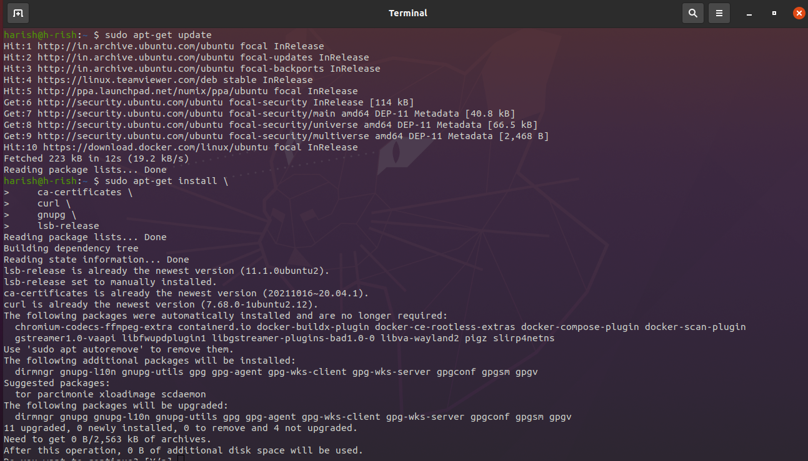 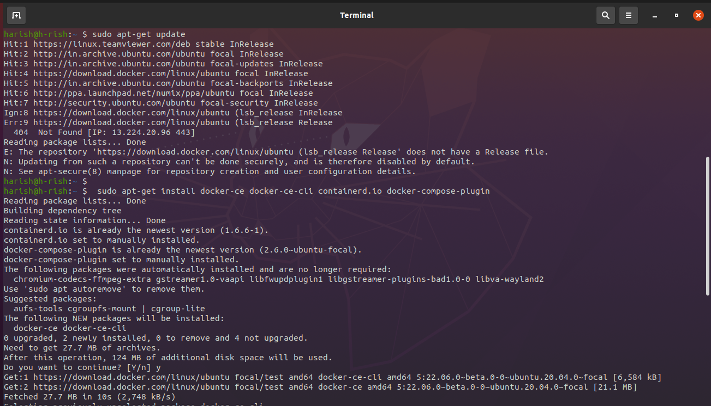
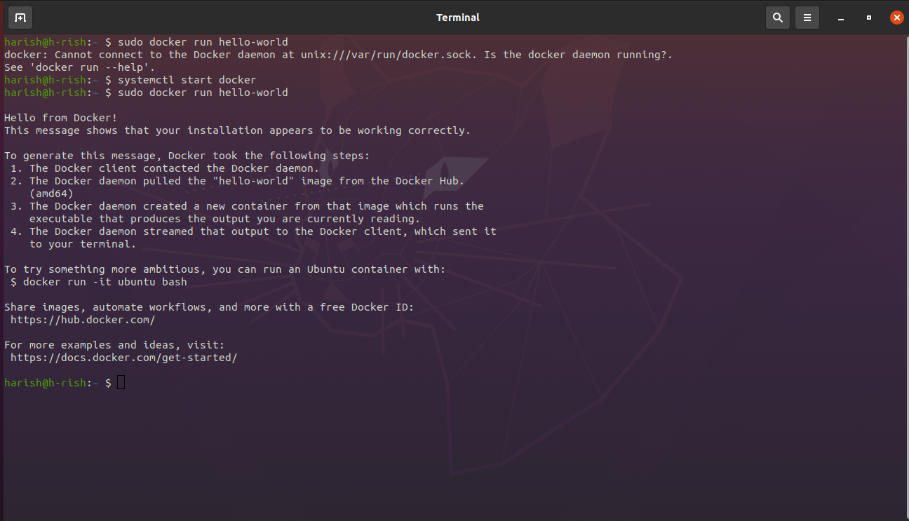
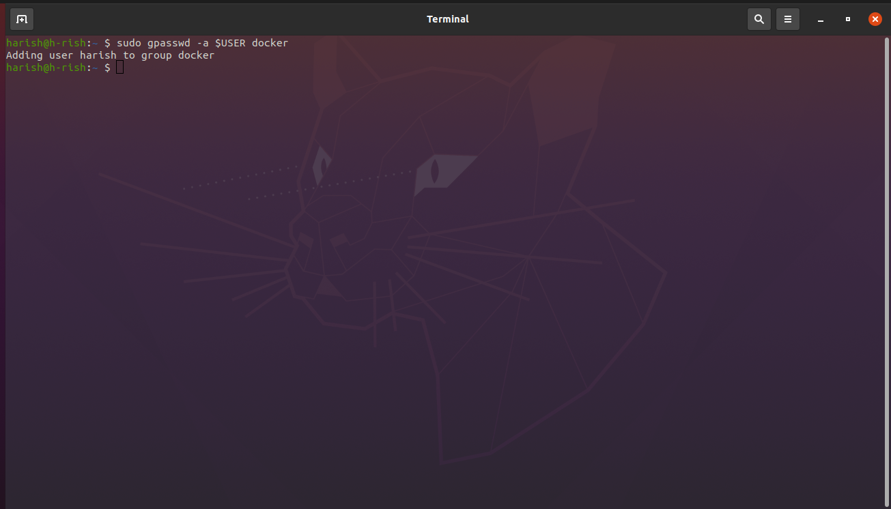
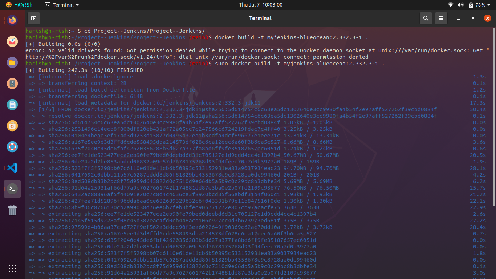
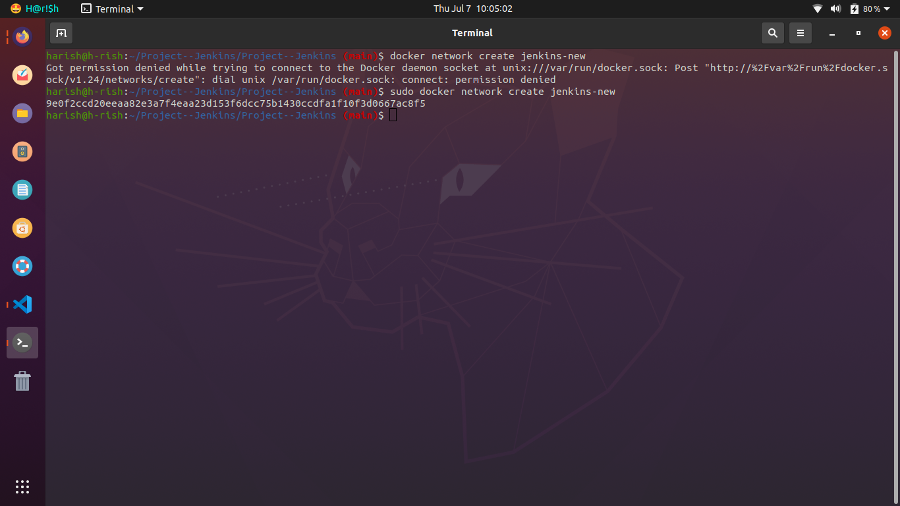
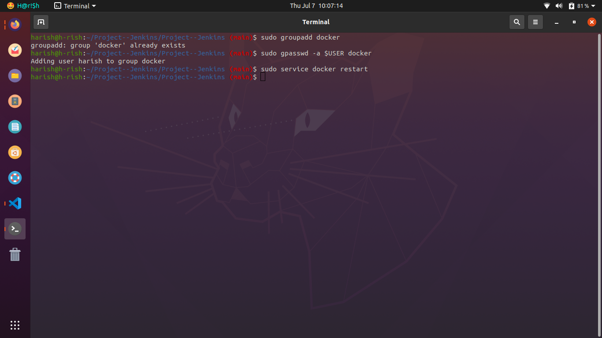
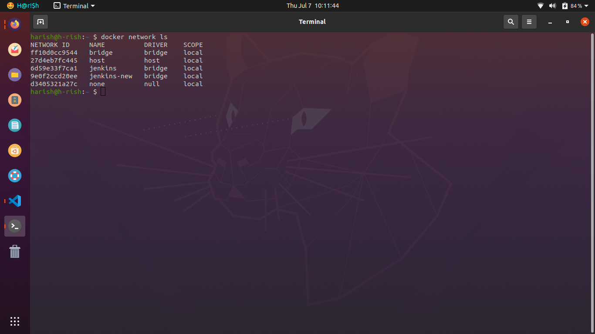
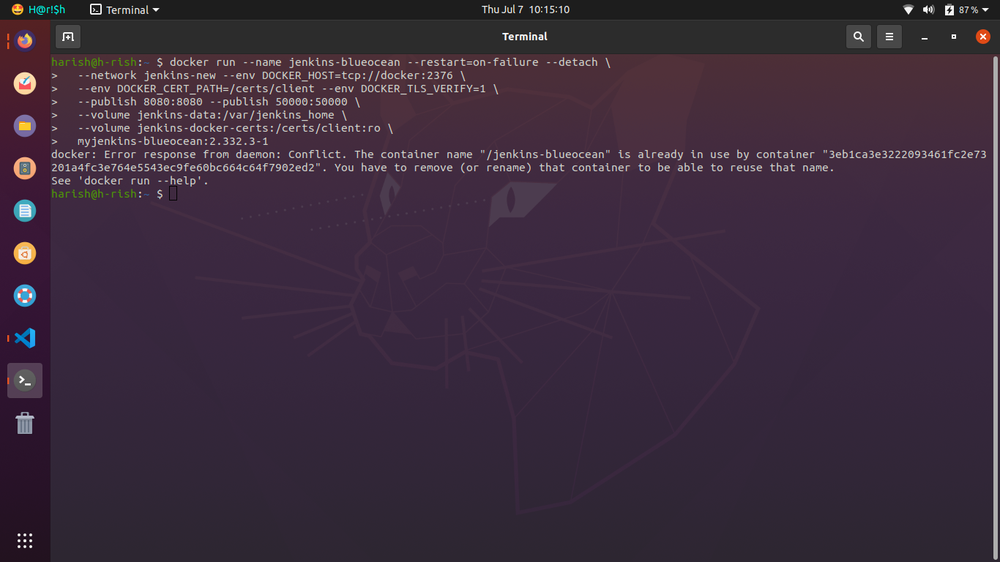
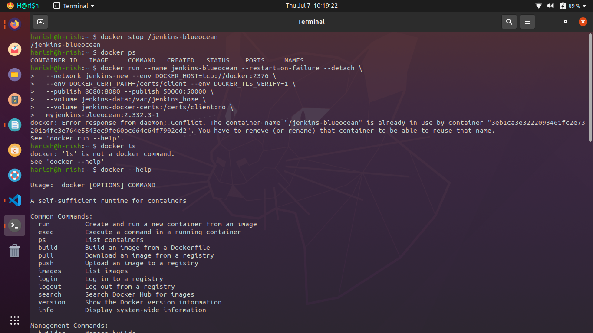
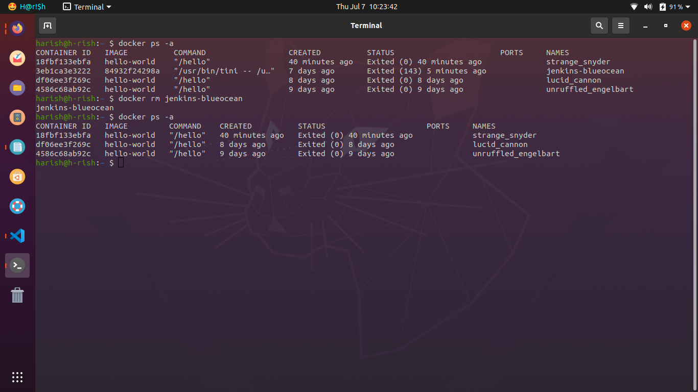
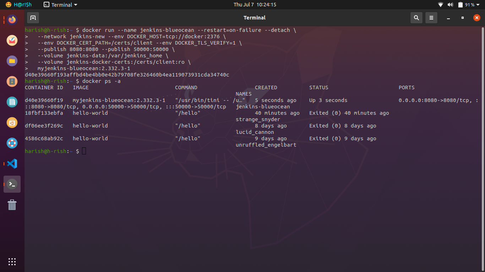
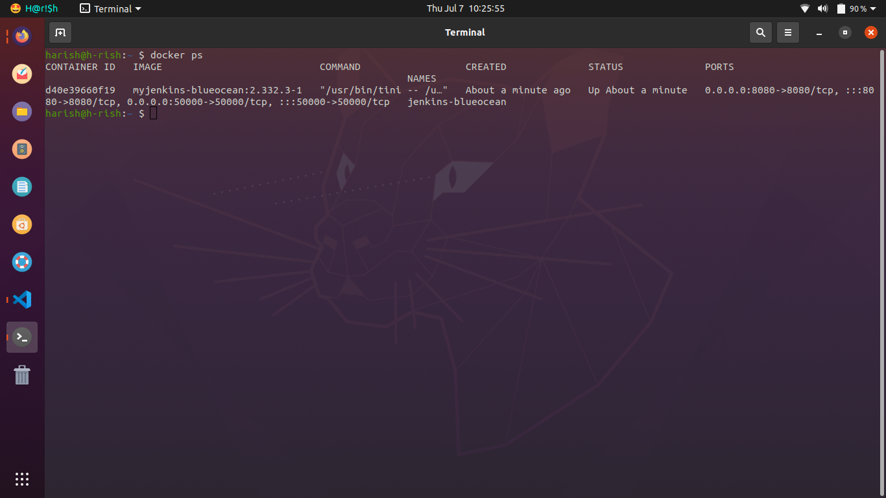
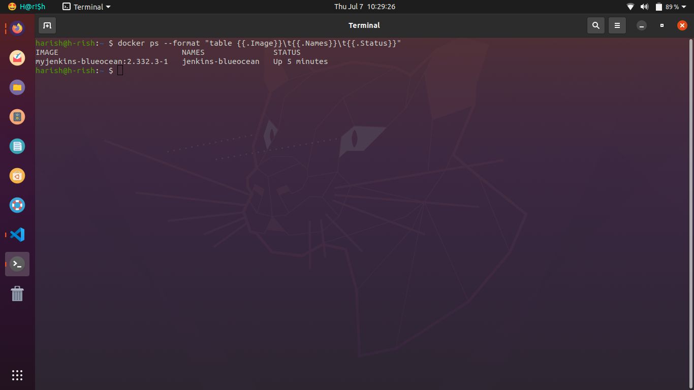

<br>

Refrences:

- [Stackoverflow - Advantages of running Jenkins in a Docker Container](https://stackoverflow.com/questions/44440164/what-are-the-advantages-of-running-jenkins-in-a-docker-container)
- [Docker Enginer Installation](https://docs.docker.com/engine/install/ubuntu/)
- [Jenkins Setup](https://www.jenkins.io/doc/book/installing/docker/)